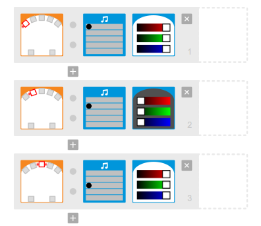
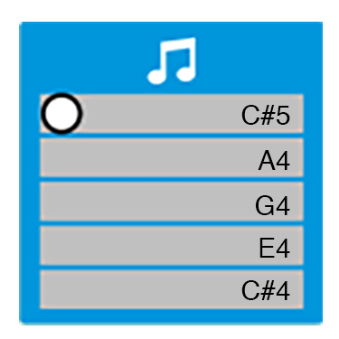

# Thymio workshop

Notes for [Crea Code Club](http://codeclub.heig-vd.ch/) [Thymio]() robot workshops for kids.

## Prep
* Install fresh version of [Aseba Studio](https://www.thymio.org/en:start)
* Max out Thymio volume. A loud Thymio is a fun Thymio. 
	1. Start or restart by pressing on middle button
	* Simultaneusly hold right and left arrow until robot turns red 
	* Press middle button while red
	* Use UP ARROW to max out volume

### Optional
Prepare a custom SD card with files to make a playable instrument using these [instructions](doc/createSoundFiles.md).

## Introduction
* Get them excited
	* Present Thymio: swiss robot made @EPFL by Francesco Mondada & team
* Get to know their skills: ask about other workshops they took. Adapt difficulty.


## 01 Thymio tunes
Create an instrument using the `Thymio VPL` software, like so.
Let them add extra actions on events.



Using [Pitch analyzer](https://itunes.apple.com/us/app/pitch-analyzer/id571243369?mt=8) 
I reverse engineered the notes: 



todo: construct a melody with these samples

## 01+ Thymio tunes+ Symphony No. 9 (Beethoven)
Since this does not use `VPL`, should probably be used as a demonstration.

* Load sounds from `/assets/sounds` onto SD card
* Insert SD card into Thymio and restart
* Load `00_playSDCardSounds.aesl` onto Thymio with `Aseba Studio`

Note | Count | Filename 
--- | --- | --- |
C | 1 | P0.wav
D | 2 | P1.wav
E | 3 | P2.wav
F | 4 | P3.wav
G | 5 | P4.wav

```
-------------------------------------
# Ode of joy
# E E F G   G F E D  C C D E  E D D
# 3 3 4 5   5 4 3 2  1 1 2 3  3 2 2
#
# E E F G  G F E D  C C D E   D C C
# 3 3 4 5  5 4 3 2  1 1 2 3   2 1 1
--------------------------------------
```

## Resources

[Intro Thymio video by Francesco Mondada](https://www.youtube.com/watch?v=QRyqZ0E5Ez0)

